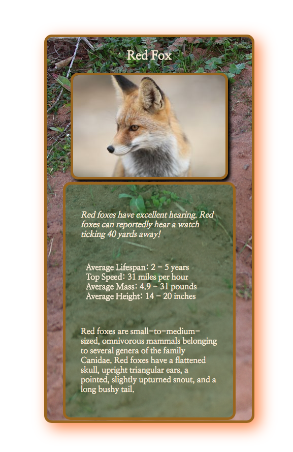

Live Project: https://bryanmiller89.github.io/animal-trading-card/
# Animal Trading Card Project

## About:
* Built using CSS and HTML
* Shows a mock trading card of a fox and basic info about the animal
* Purpose is to demonstrate knowledge of CSS styling properties and HTML tags
* Compatible with all major web browsers
## How to open project file:
1. Ensure you have an internet connection and web browser.
2. Locate the 'index.html' file within project directory.
3. Open 'index.html' file with your installed web browser.
4. Page will load showing the information captured in the screenshot above.
